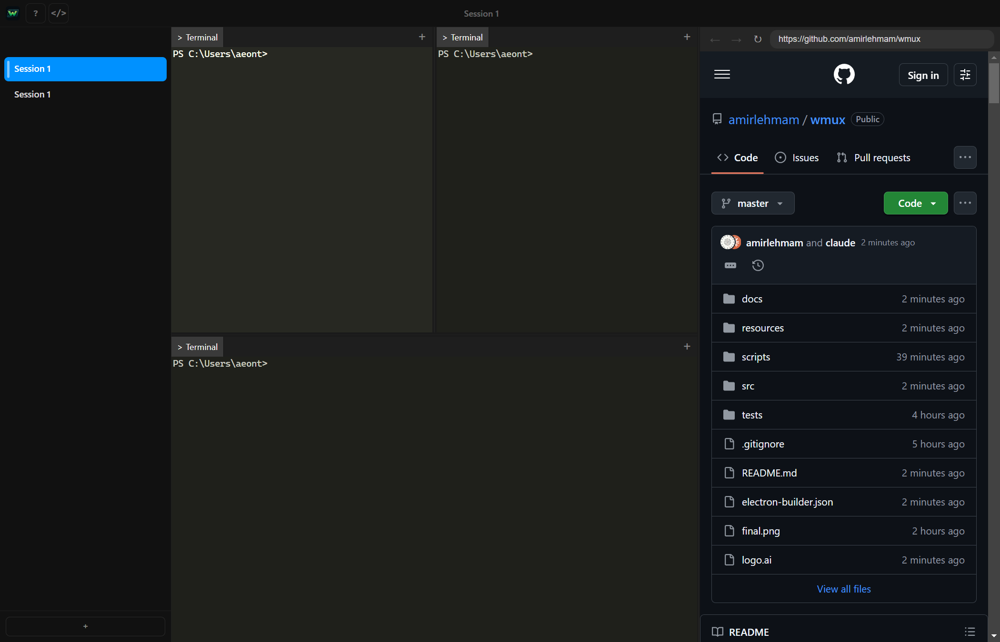

<p align="center">
  
</p>

<h1 align="center">Comux</h1>

<p align="center">
  AI 에이전트를 위한 터미널 멀티플렉서<br />
  <sub>Claude Code를 여러 개 띄우고, 무엇을 하고 있는지 한 화면에서 지켜보세요</sub>
</p>

<p align="center">
  <a href="https://github.com/Jeonghyeon-Ryu/Comux-Release/releases/latest"></a>
  
  <a href="https://jeonghyeon-ryu.github.io/Comux-Release/"></a>
</p>

<p align="center">
  
</p>

---

## 다운로드

**[⬇ 다운로드 페이지](https://jeonghyeon-ryu.github.io/Comux-Release/)** 에서 받거나, 아래에서 바로 내려받으세요.

| 대상 | 파일 | 비고 |
|:--|:--|:--|
| **Windows** 데스크톱 | [`comux-1.0.19-win-x64.zip`](https://github.com/Jeonghyeon-Ryu/Comux-Release/releases/download/v1.0.19/comux-1.0.19-win-x64.zip) | 압축만 풀면 실행 · 설치 불필요 |
| **Linux** 데스크톱 | [`Comux-1.1.0.AppImage`](https://github.com/Jeonghyeon-Ryu/Comux-Release/releases/download/v1.1.0/Comux-1.1.0.AppImage) · [`comux_1.1.0_amd64.deb`](https://github.com/Jeonghyeon-Ryu/Comux-Release/releases/download/v1.1.0/comux_1.1.0_amd64.deb) | Windows와 동일한 데스크톱 앱 |
| **Linux** 서버 / SSH | [`comux-tui-1.1.0-linux-x64.tar.gz`](https://github.com/Jeonghyeon-Ryu/Comux-Release/releases/download/v1.1.0/comux-tui-1.1.0-linux-x64.tar.gz) | 터미널 전용(TUI) · **Node 내장** |

---

## 설치

<details open>
<summary><b>Windows</b></summary>

1. 내려받은 zip **우클릭 → 속성 → 차단 해제(Unblock)** 체크 &nbsp;<sub>(Mark of the Web)</sub>
2. 원하는 폴더에 압축 해제
3. `Comux.exe` 실행

설치 프로그램·관리자 권한이 필요 없습니다.

</details>

<details open>
<summary><b>Linux 데스크톱</b></summary>

```bash
# AppImage
chmod +x Comux-1.1.0.AppImage
./Comux-1.1.0.AppImage

# FUSE 오류가 나면
./Comux-1.1.0.AppImage --appimage-extract-and-run

# 또는 deb 설치
sudo apt install ./comux_1.1.0_amd64.deb
```

</details>

<details open>
<summary><b>Linux 서버 / SSH (TUI)</b></summary>

서버에 **아무것도 설치할 필요가 없습니다** — Node 런타임이 번들에 들어 있습니다.

```bash
tar xzf comux-tui-1.1.0-linux-x64.tar.gz
comux-linux-x64/run.sh          # 데몬 기동 + TUI 접속

# SSH에서 바로 실행
ssh -t user@host '~/comux-linux-x64/run.sh'
```

</details>

---

## 빠른 시작

### 데스크톱 (Windows / Linux)

앱을 실행하면 첫 실행 튜토리얼이 안내를 시작합니다. 처음 켤 때 Claude Code 훅·브라우저 연동·오케스트레이터 플러그인이 **자동으로 구성**되므로 별도 설정이나 API 키가 필요 없습니다.

1. `Ctrl+D` 로 화면을 분할하고, 각 패널에서 `claude` 를 실행합니다.
2. 에이전트가 작업 중이면 사이드바 점이 **주황색**, 끝나면 **녹색**으로 바뀝니다.
3. 에이전트가 웹을 열면 오른쪽 **브라우저 패널**에 그대로 보입니다.

### TUI (SSH)

터미널 전용 버전은 **데몬이 세션을 소유**합니다. SSH 연결이 끊겨도 셸과 에이전트는 계속 실행됩니다.

```bash
comux-linux-x64/run.sh     # 접속 (데몬이 없으면 자동 기동)
#   … 작업 …
#   Ctrl+B 누른 뒤 q      → 분리 (셸은 계속 실행)
comux-linux-x64/run.sh     # 다시 접속하면 그대로 복구
```

---

## 단축키

### 데스크톱

| 단축키 | 동작 |
|:--|:--|
| `Ctrl+N` | 새 워크스페이스 |
| `Ctrl+T` | 새 탭 |
| `Ctrl+D` / `Ctrl+Shift+D` | 오른쪽 / 아래로 분할 |
| `Ctrl+W` | 패널 닫기 |
| `Alt+←↑↓→` | 패널 포커스 이동 |
| `Ctrl+Shift+Enter` | 패널 확대(줌) |
| `Ctrl+PgUp` / `Ctrl+PgDn` | 이전 / 다음 워크스페이스 |
| `Ctrl+B` | 사이드바 토글 |
| `Ctrl+Shift+I` | 브라우저 패널 |
| `Ctrl+Shift+E` | 코드 패널 |
| `Ctrl+Shift+P` | 명령 팔레트 |
| `Ctrl+,` | 설정 (모든 단축키 재지정 가능) |

### TUI — `Ctrl+B` 를 누른 **뒤** 키를 입력합니다

데스크톱 단축키와 같은 글자를 씁니다. SSH에서는 `Ctrl+Shift+…` 조합이 전달되지 않기 때문에 tmux처럼 프리픽스 방식을 사용합니다.

| `Ctrl+B` + | 동작 | 데스크톱 |
|:--|:--|:--|
| `←↑↓→` | 패널 포커스 이동 | `Alt+←↑↓→` |
| `d` / `Shift+D` | 오른쪽 / 아래로 분할 | `Ctrl+D` |
| `w` | 패널 닫기 | `Ctrl+W` |
| `Enter` | 패널 확대(줌) | `Ctrl+Shift+Enter` |
| `=` / `-` | 패널 크기 조절 | `Ctrl+=` / `Ctrl+-` |
| `t` | 새 탭 | `Ctrl+T` |
| `]` / `[` | 다음 / 이전 탭 | `Ctrl+Shift+]` |
| `n` | 새 워크스페이스 | `Ctrl+N` |
| `PgUp` / `PgDn` | 이전 / 다음 워크스페이스 | `Ctrl+PgUp` |
| `c` | 스크롤백(복사 모드) — `y` 복사, `q` 종료 | — |
| `q` | 분리 (데몬은 계속 실행) | — |
| `?` | **단축키 도움말 오버레이** | — |

> **마우스도 지원합니다** — 클릭으로 패널 포커스, 휠로 스크롤백.
> tmux 사용자를 위한 별칭(`%` `"` `x` `z` `<` `>` `(` `)`)도 그대로 동작합니다.

---

## CLI

실행 중인 Comux를 명령줄에서 제어합니다. 데스크톱·TUI 모두 동일합니다.

```bash
comux ls                                  # 모든 워크스페이스의 터미널 목록
comux new-workspace --title "api"         # 워크스페이스 생성
comux split --down                        # 패널 분할
comux send "npm test"                     # 터미널에 텍스트 입력
comux read-screen --lines 50              # 터미널 화면 읽기
comux notify "빌드 완료"                   # 알림 보내기

# 에이전트
comux agent spawn --cmd "claude" --label dev
comux agent list
comux agent kill <agent-id>

# 내장 브라우저 (데스크톱)
comux browser open localhost:3000
comux browser snapshot                    # 접근성 트리 (@e1, @e2 …)
comux browser click @e5
```

TUI 번들에서는 `comux-linux-x64/comux …` 로 실행하거나, 번들 폴더를 `PATH` 에 추가하세요.

---

## 자주 묻는 질문

**Windows에서 SmartScreen 경고가 떠요**
코드 서명이 되어 있지 않아 생기는 경고입니다. 압축을 풀기 **전에** zip 우클릭 → 속성 → 차단 해제를 체크하면 사라집니다.

**TUI에서 `Ctrl+B` 뒤에 뭘 눌러야 할지 모르겠어요**
`Ctrl+B` 를 누른 뒤 `?` 를 누르면 전체 단축키 표가 화면에 뜹니다. 아무 키나 누르면 닫힙니다.

**SSH가 끊기면 작업이 사라지나요?**
아닙니다. 데몬이 세션을 유지하므로 다시 `run.sh` 로 접속하면 그대로 이어집니다.

**여러 대에서 같은 세션에 붙을 수 있나요?**
가능합니다. 화면 크기는 가장 작은 클라이언트에 맞춰지며, 보기 전용으로 붙으려면 `comux attach --read-only` 를 사용하세요.

---

## 링크

- **[다운로드 페이지](https://jeonghyeon-ryu.github.io/Comux-Release/)** — 설치 안내와 매뉴얼
- **[전체 릴리즈](https://github.com/Jeonghyeon-Ryu/Comux-Release/releases)** — 이전 버전
- **[소스 코드 · 이슈](https://github.com/Jeonghyeon-Ryu/Comux)** — 버그 신고, 기능 제안

<sub>Comux는 [cmux](https://github.com/manaflow-ai/cmux)에서 출발한 오픈소스 프로젝트입니다 · AGPL-3.0</sub>
